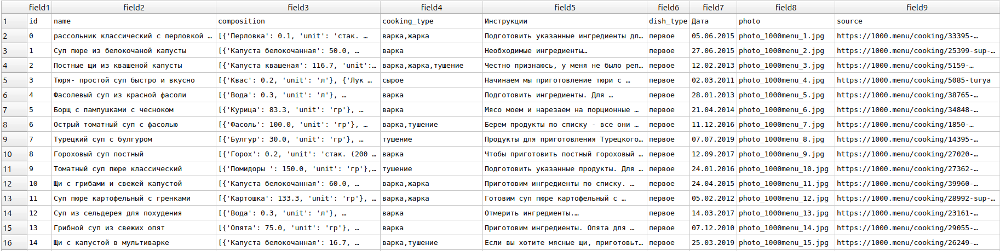

# EDA для "What to eat?"

В этом проекте нас интересуют данные рецептов и фото продуктов.

## Рецепты и игредиенты

Согласно законодательству РФ, рецепты не являются предметом интеллектуальной собственности и могут быть использованы свободно. Однако, мы постараемся минимизировать риски конфликтов с администрацией сайтов агрегаторов рецептов и использовать их данные только для бейзлайна, в будущем мы предполагаем полагаться на пользовательские рецепты.
В рамках бейзлайна мы ищем только рецепты на русском языке. Одним из вариантов является [датасет](https://www.kaggle.com/datasets/rogozinushka/povarenok-recipes) с сайта povarenok.ru, однако он требует дополнительного краулинга с оригинального сайта. Краулинг сайта оказался затруднителен из-за противодействия автоматическому сбору данных со стороны портала. Этот вариант отвержен из-за несоответствия затрат ресурсов и полученного результата.
Для реализации бейзлайна мы возьмем следующий [датасет](https://www.kaggle.com/datasets/coolonce/recipes-and-interpretation-dim), так как в нем находятся важные и удобные поля:

В загруженном датасете содержатся 27884 рецепта, чего более чем достаточно для нашей задачи. Отдельной проблемой могут являться рецепты-близнецы. Однако основное преимущество этого набора данных в подробной аннотации ингредиентов, их количества, меры измерения, а также типа блюда, что может быть крайне полезным в задаче рекомендаций.

## Фото продуктов

Мы рассматривали два варианта датасетов:
1. https://www.kaggle.com/datasets/dansbecker/food-101
2. https://www.kaggle.com/datasets/sainikhileshreddy/food-recognition-2022

В итоге было сделан выбор в пользу второго датасета, т.к. в нем содержатся интересующие нас классы, в первую очередь то, что можно отнести к ингредиентам, а не к готовым блюдам, как это сделано в food-101.
