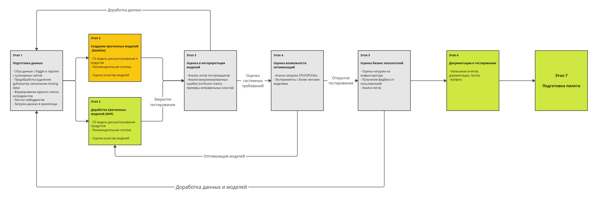
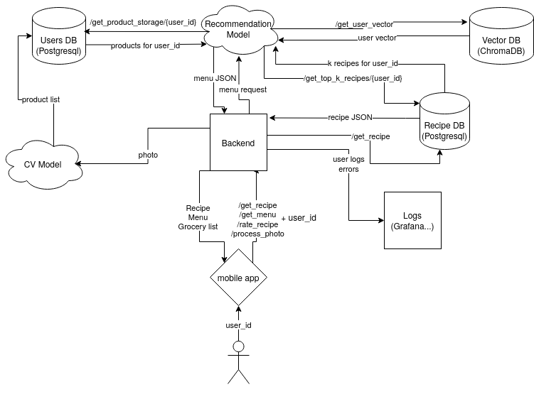

# ML System Design Doc - [RU]

## Дизайн ML системы - What to eat?

### 1. Цели и предпосылки

#### 1.1. Зачем идем в разработку продукта?  

- Бизнес-цель: Создание системы автоматического составления меню на заданный промежуток времени, использование которой позволит уменьшить количество выбрасываемых продуктов и оптимизировать траты времени и финансов на готовку.

- Текущий процесс:
  - Пользователи вручную планируют меню на неделю
  - Проверяют наличие продуктов на кухне
  - Составляют список покупок
  - ~30% продуктов выбрасывается из-за отсутствия планирования
  - В среднем тратится 2-3 часа в неделю на планирование

- Почему станет лучше с ML:
  - Персонализированный подход уменьшит количество нерелевантных советов
  - CV модели упростят ведение статистики по использованию продуктов
  - Автоматизация сократит время на планирование до 15 минут в неделю
  - Прогнозируемое снижение food waste на 60%

- Критерии успеха итерации:
  - Увеличение retention на 40% по сравнению с версией без ML
  - Рост MAU на 25% в течение первых 3 месяцев
  - Снижение food waste на 60% (по опросам пользователей)
  - Процент положительных ответов на релевантность меню > 75%
  - Увеличение среднего времени использования приложения с 5 до 15 минут в день

#### 1.2. Бизнес-требования и ограничения  

- Краткое описание БТ и ссылки на детальные документы с бизнес-требованиями:
  - Система должна формировать персонализированное меню на неделю/месяц
  - Система должна учитывать имеющиеся продукты пользователя
  - Необходима функция распознавания продуктов по фото
  - Интеграция со списком покупок
  - Учет пищевых предпочтений и ограничений пользователя

- Бизнес-ограничения:
  - Время отклика системы не более 10 секунд
  - Поддержка только популярных продуктов, доступных в основных сетевых магазинах
  - Ограничение по размеру файлов отправляемых на сервер
  - Необходимость работы в оффлайн режиме для основных функций (генерация меню)

- Что мы ожидаем от конкретной итерации:
  - MVP с базовым функционалом распознавания продуктов
  - Формирование меню на неделю в соответствии с набором распознанных или введенных вручную продуктов
  - Базовая персонализация
    - Корректирование генерации с помощью оценки пользователя, учет его аллергий и предпочтений

- Описание бизнес-процесса пилота:
  - Запуск с ограниченной группой пользователей (20-50 человек), репрезентативной по пищевым предпочтениям (веганы, вегетарианцы) и аллергиям
  - Сбор обратной связи через опросы и метрики использования
  - Тестирование нагрузки на серверную инфраструктуру, выявление узких мест обработки пользовательских данных

- Критерии успешного пилота:
  - Точность распознавания продуктов > 90% (учитываются только наименования отдельных объектов, не учитывается их количество)
  - Retention rate после недели использования > 60%
  - Положительные отзывы о релевантности меню > 75%
  - Средний период генерации меню > 2 дней
  - Количество незаменимых нерелевантных продуктов в сгенерированном меню < 5%

- Возможные пути развития
  - Оптимизация работы CV моделей, перенос вычислений на пользовательские устройства

#### 1.3. Что входит в скоуп проекта/итерации, что не входит

- На закрытие каких БТ подписываемся в данной итерации:
  - Распознавание продуктов
    - Распознавание основных категорий продуктов (овощи, фрукты, мясо, молочные продукты) по одной фотографии
    - Внесение дополненных пользователем данных по наличию продуктов в базу данных
  - Создание базовой рекомендательной системы для генерации меню
    - Генерация меню в расчете из 3 блюда/день из имеющихся продуктов
    - Учет базовых пищевых ограничений (вегетарианство, веганство), наличие "черного списка" для каждого пользователя
      - Генерация меню на срок от 1 до 5 дней
  - Разработка механизма обратной связи для улучшения рекомендаций
    - Сбор оценок релевантности меню по пользователю
    - Учет отвергнутых рекомендаций для каждого пользователя

- Что не будет закрыто:
  - Распознавание количества продуктов на фото
  - Определение срока годности по фото этикетки
  - Распознавание редких или экзотических продуктов
  - Генерация меню более чем на неделю
  - Учет калорийности и пищевой ценности
  - Интеграция с онлайн-магазинами
  - Распознавание готовых блюд
  - Перегенерация меню с учетом обратной связи

- Описание результата с точки зрения качества кода и воспроизводимости решения:
  - Документированный код с покрытием тестами > 80%
  - CI/CD пайплайн для моделей CV
  - CI/CD пайплайн для алгоритмов генерации меню
  - Система сбора обратной связи
  - Версионирование данных и моделей
  - Автоматизированное тестирование API endpoints
  - Документация по развертыванию системы

- Описание планируемого технического долга (что оставляем для дальнейшей продуктивизации):
  - Масштабирование системы для большего числа пользователей
  - Интеграция с внешними API для получения информации о продуктах
  - Реализация офлайн-режима работы на endpoint устройстве

#### 1.4. Предпосылки решения  

- Описание бизнес-процесса пользователя:
  1. Вход в приложение
  - Авторизация через email/соцсети
  - Заполнение профиля с предпочтениями
  2. Первичная настройка
     - Указание диетических ограничений
     - Выбор любимых/нелюбимых продуктов
     - Начальная оценка 10 случайных рецептов
  3. Основной процесс использования
     - Фотографирование продуктов (1-3 фото)
     - Проверка и корректировка распознанных продуктов
     - Выбор периода для генерации меню
     - Получение персонализированного меню
     - Корректировка меню при необходимости
     - Экспорт списка недостающих продуктов
  4. Обратная связь
     - Оценка релевантности рецептов
     - Отметка приготовленных блюд
     - Комментарии и корректировки рецептов

### 2. Методология

#### 2.1. Постановка задачи  

1. Мобильное приложение для генерации меню на заданный период через обращение по API к развернутым на нашем сервере моделям и алгоритмам
   - Поддержка IOS и Android
2. Multi-task Computer Vision
   - Задача: Обнаружение и классификация продуктов на фото (object detection + multi-label classification)
   - Вход: Фото холодильника/продуктов (RGB, 640x640)
   - Выход: Список распознанных продуктов
3. Контекстно-зависимая рекомендательная система
   - Задача: Поиск рецептов по векторам: f(user_prefs, available_ingredients) → ranking (ДОБАВИТЬ ПРО УЧЕТ ИНГРЕДИЕНТОВ ПРИ ПОДСЧЕТЕ РЕКОМЕНДАЦИЙ)
   - Выход: Топ-5 персонализированных рецептов

#### 2.2. Блок-схема решения

#### 2.3 Этапы решения задачи Data Scientist

**1. Подготовка данных**
Данные которые нам понадобятся: корпус рецептов, обучающий датасет для распознавания продуктов.

Cсылки на датасеты:

1. [Food Recognition 2022](https://www.kaggle.com/datasets/sainikhileshreddy/food-recognition-2022)

- `MS-COCO format`

2. [recipes 27к (с сайта 1000.menu)](https://www.kaggle.com/datasets/coolonce/recipes-and-interpretation-dim)

- `.csv`
- Столбцы: "name", "ingredients (composition)", "cooking type", "instructions", "dish type", "photo"

Рецепты не планируем краулить в будущем, предполагаем использовать краудсорс и добавление рецептов пользователями на более поздних этапах. В бейзлайне и MVP реализовано не будет т.к. требует модерации, пользовательской базы и дополнительного функционала приложения.

- Этап 1 - Скачивание данных рецептов с Kaggle и их предобработка
  - Удаление дубликатов рецептов
  - Заполнение missing data по колонкам "тип блюда/кбжу/веган"
  - Проверка наличия иллюстраций к рецептам, исследование возможности подгрузки/генерации недостающих
- Этап 2 - Формирование списка ингредиентов из полученной выше таблицы
- Этап 3 - Обработка датасета с фото ингредиентов
  - Маппинг полученного на Этапе 2 списка ингредиентов на обучающий датасет фото/продукты с Kaggle
  - Рассматриваем случаи мисматча, проверяем можно ли объединить классы
  - Получаем список несовместимых классов, которые возможно нужно будет дропнуть (ингредиенты которых нет в рецептах)
  - Аугментация визуальных данных (поворот, тонирование, разница в насыщенности цветов, яркость)
- Этап 4 - Обработка датасета с ингредиентами
  - Проставление 1/0/-1 в столбце Веган (1 - веган, 0 - не веган, -1 - вегетарианец). Можно использовать LLM или ассесоров.
  - Сведение классов в соответствии с Этапом 3
- Этап 5 - Обработка датасета с рецептами
  - Фильтрация рецептов в соответствии с Этапом 3
  - Создание эмбеддингов рецептов из текста и списка ингредиентов подаваемых на вход текстовому энкодеру BGE-3
  - Проставление 1/0/-1 в столбце Веган в соответствии со списком ингредиентов
- Этап 6 - Загрузка данных в базы данных
  - PostgreSQL для рецептов и ингредиентов
  - ChromaDB для эмбеддингов рецептов
  - Сохранение в отдельный датасет модифицированного набора данных с картинками продуктов и лейблами

Результат этапа:

- База данных с рецептами
  - Векторная база данных с эмбеддингами рецептов
- База данных с ингредиентами
- Датасет с фото/ингредиентами для классификации

Риски:

- Сложности с соотнесением названий продуктов между датасетами - ложно-положительный мисматч
- Не до конца формальный список "нераспознаваемых" продуктов - например, мука, специи, растительное масло, соль и прочие продукты которые есть "по умолчанию"
- Ингредиентов (и соответственно классов для классификатора) может быть очень много, вероятно логичнее будет завести несколько моделей для распознавания - 1 общая модель с классами вроде "мясо", "фрукт", "овощ", "готовый продукт" и т.д. и отдельные модели распознающие элементы внутри каждого из классов

**2. Подготовка прогнозных моделей**
Модель для распознавания продуктов:

- Метрики
  - mean average precision
  - f1
- Функция потерь
  - Комбинированная функция YOLO: BCEWithLogitsLoss для классификации + CIoU Loss для регрессии bounding box
- Валидация модели
  - Аугментация редких классов
  - train/test/val выборки
  - Валидация на отдельном датасете с "сложными" случаями (перекрытые объекты, плохое освещение)
- Бейзлайн
  - Модель: Pretrained YOLOv8n без дообучения
  - Ресайз изображений до 640x640
  - Инференс на датасете Kaggle Food-101, оценка mAP@0.5
- Стратегия развития
  - Дообучение моделей YOLO
  - Проверка гипотезы об использовании моделей для классификации "общих категорий" и продуктов внутри категорий
- Анализ и интерпретация
  - Анализ confusion matrix для выявления классов-близнецов
  - Визуализация ошибок: примеры фото с ложными срабатываниями/пропусками
- Риски и способы их снижения
  - Низкое качество распознавания редких продуктов
    - Сбор размеченных фото от пользователей
  - Низкая скорость работы алгоритма
    - Оптимизация модели
- Результат этапа
  - Рабочий CV сервис с mAP > 0.85
  - Документация

Рекомендательная система:

В отсутствии данных пользователей предлагается использовать рекомендацию по схожести векторов рецептов (BGE encoder принимающий на вход рецепт и список продуктов). Также на оценку влияет оценка пользователя и наличие ингредиентов из стоп-листа.

При регистрации пользователю предлагаются на выбор 10 рецептов которым нужно поставить лайк/дизлайк. Усредненные вектора этих рецептов (рецепты с дизлайком берутся отрицательными) составляют "вектор вкуса" пользователя. Далее в рекомендациях используется он и обновляется при каждой оценке.

- Метрики
  - На данном этапе просто собираем количество одобренных рецептов
  - Cosine distance
- Валидация модели
  - Проверка работы с помощью ассесоров
  - A/B-тестирование в пилоте: сравнение с разделом "Самые популярные рецепты"
- Бейзлайн
  1. Получение вектора вкуса пользователя
  2. Получение n=50 ближайших по косинусному расстоянию рецептов
  3. Фильтрация по стоп-листу пользователя
  4. Ранжирование по пересечению ингредиентов имеющихся у пользователя и требуемых в рецепте
  5. При количестве n>=5 рецептов после фильтрации выдача их пользователю
  6. При количестве n<=5 рецептов после фильтрации переходим на шаг 2 с выборкой n=100
- Анализ и интерпретация
  - Оценка логов пользователей, conversion rate из рекомендаций в историю
- Риски и способы их снижения
  - Рекомендация продуктов из одной категории (два раза сделал суп и теперь в рекомендациях одни супы) и одних и тех же блюд (гречка с сосиской на каждый день)
    - Добавление рандомизации, штрафы на повторяющиеся категории в списке рекомендаций, штрафы на повторы в истории рецептов
  - Низкая скорость работы алгоритма
    - Оптимизация или выбор другой модели, кеширование, оптимизация поиска
- Результат этапа
  - Рабочий сервис рекомендаций
  - Документация

### 3. Подготовка пилота

#### 3.1 Способ оценки пилота

- Логгирование действий пользователей
  - Использование функции "Photo to grocery list", генерации меню, экспорта сгенерированного меню в список покупок
  - Количество корректировок пользователями автоматически распознанных продуктов
- Регулярность захода в приложение
- Время ожидания от фото до готового меню
- Количество отметок "Приготовлено" на блюдах в меню
- Автоматизированные опросы ("Были ли предложенные блюда релевантными?", "Продолжите ли вы пользоваться сервисом?")
- Мониторинг нагрузки на сервер (время ответа API, использование GPU/CPU)

#### 3.2. Что считаем успешным пилотом

- Пользовательские метрики
  - Retention rate (7 дней) ≥ 60%
  - Доля положительных ответов на вопрос о релевантности меню ≥ 75%
- Системные требования
  - Среднее время генерации меню ≤ 10 сек (при нагрузке 50 параллельных запросов)
  - Точность распознавания продуктов > 90% (учитываются только наименования отдельных объектов, не учитывается их количество)
- Бизнес-метрики
  - 80% пользователей экспериментальной группы используют функцию генерации меню ≥ 2 раз за неделю
  - Процент рекомендованных блюд с нерелевантными продуктами < 5%

#### 3.3. Подготовка пилота

**Ограничения и расчеты**
Вычислительные ресурсы:

- Для CV-модели (YOLOv8n):
  - 1 GPU (NVIDIA T4) на 50 пользователей (макс. 10 одновременных инференсов).
  - Память: 4 GB VRAM на сервер.

- Для рекомендательной системы (BGE-3):
  - CPU-инференс с кешированием эмбеддингов (32 GB RAM).

Ограничения:

- Максимальный размер фото: 5 MB.
- Частота генерации меню: ≤ 10 раз/день на пользователя.
- Оффлайн-режим: кеширование 100 популярных рецептов на устройстве.

**Оптимизация**

- Использование квантования для CV-модели (FP16).
- Батчинг запросов к векторной БД (ChromaDB).

**Мониторинг**

- Автоматическое масштабирование GPU-нод при загрузке > 70%.

**Резервный план**

При превышении лимитов вычислений:

- Временное отключение CV-модели для новых пользователей
- Упрощение рекомендательного алгоритма (поиск по 20 ближайшим рецептам вместо 50)
- Предусмотрено 20% ресурсного буфера для непредвиденных нагрузок

### 4. Внедрение, масштабирование и развитие

#### 4.1 Архитектура решения

Базы данных: PostgreSQL, ChromaDB
Отдельные микросервисы для моделей и бекенда

#### 4.2 Масштабирование компонентов

- Backend: Nginx для распределения трафика
- CV Service: автоматическое масштабирование GPU-нод в K8s
- Recommendation Service: кластеризация и кеширование рекомендаций похожих пользователей
- Databases:
  - PostgreSQL: master-slave репликация
  - ChromaDB: шардирование по user_id

#### 4.3 Потенциальные узкие места

- Latency CV-модели при высокой нагрузке
- Время поиска в векторной базе при росте числа рецептов и пользователей
- Network I/O при загрузке фотографий

#### 4.4 Требования к работе системы (SLA)

- Пропускная способность: 1000 пользователей в минуту
- Задержка не более 500 мс.
- Доступность сервиса 99% времени
- Устойчивость к потере данных пользователей

#### 4.5 Безопасность системы и данных

1. Опасности:

- DDoS
- Отправка мусорных или опасных данных пользователями под видом рецептов и фото
- Нарушения авторских прав на использование рецептов и фото

2. Меры защиты:

- Rate Limiting, своевременное обновление зависимостей
- Пользовательское соглашение учитывающее вопросы авторских прав
- Модерация и автоматическая проверка пользовательских данных

#### 4.6 Обновление моделей

Обновление CV моделей происходит через добавление в обучающие данные пользовательских фото, подкачка данных из появляющихся датасетов. Для автоматизации используется AirFlow и S3 хранилища.
По анализу пользовательских логов проводится доработка рекомендательной системы.

#### 4.7 План развития системы

- Интеграция с онлайн-магазинами и сервиса доставки продуктов
- Добавление GPU-оптимизированных моделей
- Внедрение Feature Store для кеширования эмбеддингов
- Переход на федеративное обучение для персонализации
- Перенос части вычислений и данных на конечные устройства (офлайн рецепты, подсчет вектора пользователя)
